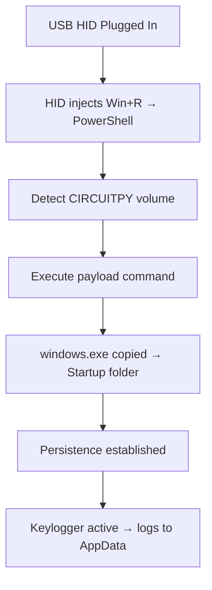

# 🛡️ USB HID Attack Chain – Red Team Persistence PoC

## 📌 Executive Summary

This repository demonstrates a **full attack chain Proof-of-Concept** leveraging a **malicious USB HID device** (keyboard emulation) to establish **persistence on Windows systems**.

The attack chain is fully automated:

1. HID injects PowerShell commands.
2. The target USB volume (`CIRCUITPY`) is identified.
3. A custom persistence implant (`windows.exe`) is deployed into the **Windows Startup folder**.
4. The implant executes silently in **stealth mode** and logs keystrokes for collection.

⏱ **Time from device insertion to persistence: \~10 seconds**

This project was created as a **controlled Red Team training exercise** and demonstrates how endpoint defenses can be bypassed with minimal tooling.

---

## ⚔️ MITRE ATT\&CK Mapping

| Tactic              | Technique                                                               |
| ------------------- | ----------------------------------------------------------------------- |
| **Initial Access**  | \[T1200] User Execution: Malicious File (USB HID injection)             |
| **Execution**       | \[T1059.001] Command & Scripting Interpreter: PowerShell                |
| **Persistence**     | \[T1547.001] Boot or Logon Autostart Execution: Registry/Startup Folder |
| **Defense Evasion** | \[T1140] Execution via compiled binary (`-mwindows` hides console)      |
| **Collection**      | \[T1056.001] Input Capture: Keylogging                                  |
| **Impact**          | Local data capture available to attacker                                |

---

## 🔗 Attack Chain Overview



---

## 🚀 Components

### 🔹 `payload.dd` – HID Payload

* Emulates keyboard keystrokes.
* Opens `Win+R` and launches hidden PowerShell.
* Detects mounted drive `CIRCUITPY`.
* Executes inline commands

### 🔹 `windows.exe` – Persistence Implant

* Written in C and compiled with:

  ```bash
  x86_64-w64-mingw32-gcc windows.c -o windows.exe -mwindows
  ```
* Features:

  * Runs in **stealth mode** (no console).
  * Implements lightweight **keylogging** with local storage in `AppData`.

---

## 🧪 Lab Evaluation

* **Environment:** Windows 11 (x64), fully patched, Microsoft Defender enabled (default).
* **Execution Success:** ✅ Yes
* **Persistence Success:** ✅ Yes
* **Detection Events:** ❌ None (Defender did not trigger)
* **Full Attack Time:** \~10 seconds from USB insertion.

### Observations:

* Windows Defender did not classify the EXE as malicious.
* PowerShell inline execution bypassed script execution policy restrictions.
* Attack chain remained **completely silent** to the user.

---

## 📂 Repository Layout

```
/project
 ├── payload.dd       # HID keystroke injection payload
 ├── windows.c        # Source code for Keylogger
 ├── windows.exe      # Compiled implant (-mwindows, stealth mode)
 └── README.md        # Documentation & methodology
```

---

## 🏆 Key Takeaways

* HID devices can reliably bypass user interaction requirements.
* Script execution restrictions (ExecutionPolicy) can be bypassed via inline PowerShell.
* Default endpoint protections may fail against custom binaries and HID-based delivery.
* The attack demonstrates a **full kill chain** from access → persistence → collection.

---

## ⚠️ Disclaimer

This project is intended strictly for:

* **Educational purposes**
* **Red Team / Security research in authorized environments only**

⚡ Do **NOT** deploy on production systems or without explicit written permission.
Unauthorized use may violate local and international laws.

---

## 👤 Author

- `salmontts`  
- [github.com/salmontts](https://github.com/salmontts)

---
